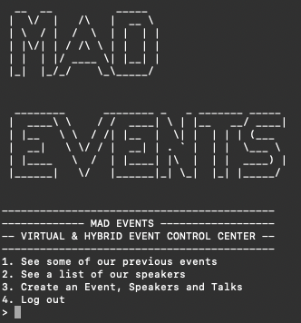
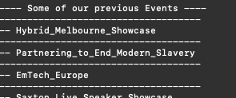
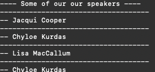
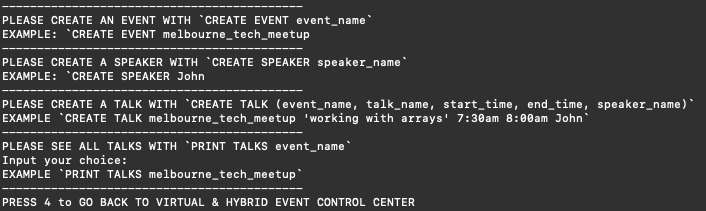
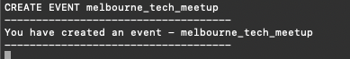
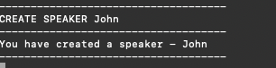
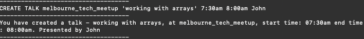
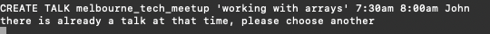
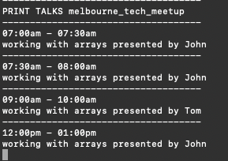

# Mad Events - Delegate Connect Technical Challenge



A CLI application that will let the client create an event, an array of timed talks and a speaker. Each talk belongs to one Event and cannot overlap in time with another. Each talk has one speaker.

The following commands will work on the terminal
- CREATE EVENT event_name
- CREATE SPEAKER speaker_name
- CREATE TALK event_name talk_name talk_start_time talk_end_time speaker_name
- PRINT TALKS event_name => output the talks for an event sorted by the start time

## Setup

Clone the GitHub repository and change directory into `Mad Events`:
```
git clone ..
```

This application was built with Ruby 2.6.6

You can check your Ruby version with:
```
ruby -v
```

You will also need Bundler installed:
```
bundle install
```
This will install the gems needed to run the program correctly.


## Launching the app

1 - To start the app Mad Events, enter:
```
ruby app.rb
```

(please note at anytime you wish to leave the app just press `4` on each window)


2 - On the Main Menu you can see previous events with `1` or previous speakers with `2`





3 - Press `3` to load up the Creation Menu where a user can create events, speakers and talks.



4 - You can create an event with `CREATE EVENT melbourne_tech_meetup`, please note that the event must be in snake_case if it more than two words.



5 - You can create a speaker with `CREATE SPEAKER John`, please note that the speaker must be in snake_case if it more than two words.



6 - You can create a talk with the correct formatting `CREATE TALK melbourne_tech_meetup 'working with arrays' 7:30am 8:00am John`. Please note that the talk name must have apostrophe around with them no special characters and the speaker and event must already be created. You can also use 15:00 or 3pm time. Feel free to get one of these wrong when creating the string. Have a look what happens!



7 - You can create as many talks, speakers and events as you like. The talks cannot overlap or you will see an error.



Print off the talks in ascending order for a specific Event with `PRINT TALKS melbourne_tech_meetup`




## Testing

I tried my best to add some testing to the application. I tested the models, repositories and controllers for the main features.

You can run the tests with


```
rspec spec
```

## Considerations

1. I did the Mad Events challenge trying my best to follow OoP and TDD principles.

2. My engineering focus of this application was with a classic Ruby MVC design pattern with router & repository included.

3. I choose to create a CSV database for the application to pull and store data when the app was running. You can see in action this by pressing `1` or `2` on the start menu OR

Run these commands on the model creation menu
```
PRINT TALKS Hybrid_Melbourne_Showcase
PRINT TALKS Partnering_to_End_Modern_Slavery
```

## Steps

1. I started by creating the models, repositories and tests for each speaker, event and talk. My basic idea was to use the talk model to store instances of the speaker and event and call from this when validating talks.

2. I then worked on how I was going to integrate the application to take user input/take from the database with a central controller, views and a router.

3. I split the controllers up in to seperate parts relating to the models and ran the application a few times and tried squashing any string validation bugs.

4. I refined the process and added more tests and data to the database.


## Ideas for the future:

1. Regex validation could have been stronger. Could have spaces within the event and speaker name.

2. String and object validations for event and speaker - e.g. return an error if an event is already in the database.

3. Saving data to the database with CSV upon creation of event, speaker or talk. (I’ve left comments in the repository code).

4. Deeper tests with rspec.

5. Add validations for reverse time e.g. it won't let you make a talk with a start time 4pm end time 3pm etc.

6. More bug testing with different users trying out the application.

## What I learned

1. Could have added an instances of talks to the event model in the back end. I didn't feel this was absolutely necessary but would consider doing this in the future if I redid the challenge or the application needed more flexibility.

2. Use branches to work out details and push to main branch on GitHub.

3. Could have refined my testing before writing my code.

## References

[TOD gem Documentation](https://github.com/jackc/tod)

[ARTII gem Documentation](https://github.com/miketierney/artii)

[PRY gem Documentation](https://github.com/pry/pry)

[RSPEC Documentation](https://rspec.info/documentation/3.10/rspec-core/)

